<!--
<div id="top"></div>


<div align="center" >

[](https://www.javascript.com)
[](https://html.com/html5/)


[](https://nodejs.org/en/)
[](https://GitHub.com/Naereen/badges/)
[](https://www.mongodb.com/)
[](https://github.com/omar-sherif9992)


</div>

<br>

<div align="center>
   
</div>


<a href=""><h1 align="center">Welcome to Abo Mota Clinic</h1></a>


# Virtual Clinic - A Comprehensive Healthcare Management System

## Motivation

In the pursuit of making healthcare more accessible and management more seamless, this project was born out of the need to bridge the gap between patients and healthcare providers. The Virtual Clinic platform is designed to offer an integrated environment for patients, doctors, and administrators to interact, manage medical records, and facilitate healthcare services efficiently.

## Build Status

The current build is in the alpha stage with core functionalities implemented. Continuous integration is in place, ensuring build stability. Known issues are documented and tracked for resolution.

## Code Style

The project adheres to the "standard" coding conventions for clarity and maintainability. This ensures that contributions and reviews can be conducted with ease, maintaining a consistent codebase.

## Screenshots


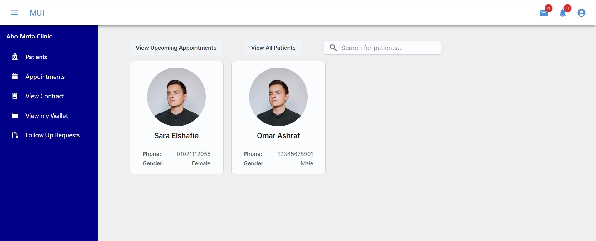


## Tech/Framework Used


- **Backend**: Node.js, Express
- **Frontend**: React.js, Redux for state management
- **Database**: MongoDB
- **Authentication**: JWT for secure login sessions


## Features

### Guest Registration
- Registration options for both patients and doctors with detailed personal and professional information.

### Document Management
- Allows patients to upload or remove medical documents.
- Guests registering as doctors must submit identification, medical licenses, and degrees.

### Login and Logout
- Secure access for doctors, patients, and administrators using usernames and passwords.

### Administrator Privileges
- Administrators can add or remove users, including doctors, patients, and other administrators.
- They review and decide on doctor registration requests and manage health packages.

### Password Management
- Users can change or reset passwords with email-based OTPs for security.

### Doctor Features
- Doctors can edit profiles, set hourly rates, manage affiliations, add availability for appointments, and handle prescriptions and health records.

### Patient Features
- Patients can add family members, link other patient accounts, manage payment options, and view and subscribe to health packages.
- Schedule, reschedule, or cancel appointments.
- View health records and prescriptions.

### Appointments and Health Records
- Both doctors and patients can filter and view appointments and health records.
- Doctors have access to their patients' information.

### Prescription Management
- Doctors manage prescriptions, and patients can view and pay for them using various methods.

### Communication and Notifications
- Chat functionality and notifications for appointments and prescription statuses.

### Video Calls
- Facilitate video calls between doctors and patients.

### Follow-up Sessions
- Patients can request follow-ups, and doctors can manage these requests.

### Financial Transactions
- Users can view wallet balances, receive refunds, and make payments for services and prescriptions.

## Detailed Features

### Account Registration
- Comprehensive registration for patients and doctors.

### User Authentication
- Secure login and logout for all user roles.

### Administrator Capabilities
- Account management and oversight of doctor registrations.

### Profile and Password Management
- Profile updates and secure password management.

### Doctor-Specific Functionalities
- Professional detail management and appointment scheduling.

### Patient-Centric Features
- Family management, appointment handling, and health package subscriptions.

### Appointment Management
- Comprehensive appointment scheduling system.

### Prescription Handling
- Detailed prescription management and payment options.

### Communication and Alerts
- Integrated chat system and timely notifications.

### Video Consultations
- Video calling feature for virtual consultations.

### Financial Management
- Financial transactions, wallet management, and refund processing.


## Code Examples

*Code snippets will be  here.*

### Installation

Clone the repository:

   ```bash
   git clone https://github.com/advanced-computer-lab-2023/Abo-Mota-Clinic.git
   cd Abo-Mota-Clinic
   ```

# Install client dependencies

  ```bash
  cd client
  npm install
```
# Install server dependencies
  ```bash
    cd backend
    npm install
```
# Running the Application
## Start the client:
 ```bash
cd client
cd src
npm start
```
The client server will run on http://localhost:3000.
## Start the server:
 ```bash
cd backend
nodemon server.js
 ```

Open your browser and navigate to http://localhost:3000 to access the simulator.

## How to Use

The Virtual Clinic system is designed to be intuitive and user-friendly. Here is a step-by-step guide to help you navigate through the main functionalities:

### For Patients

1. **Creating an Account**: Start by registering as a patient with your personal details on the Virtual Clinic platform.
2. **Logging In**: Use your credentials to log in and access patient-specific functionalities.
3. **Managing Medical Records**: Upload and manage your medical documents securely within the platform.
4. **Booking Appointments**: Browse available doctors, view their schedules, and book appointments that suit your convenience.
5. **Managing Prescriptions**: View and manage your prescriptions, with options to pay for them directly through the platform.

### For Doctors

1. **Registration**: Sign up as a doctor by submitting your professional credentials for verification.
2. **Appointment Management**: Set your availability and manage appointments scheduled by patients.
3. **Patient Records**: Access and review your patient's medical history and documents to provide the best care possible.

### For Administrators

1. **Account Oversight**: Manage user accounts, including the ability to add or remove patients, doctors, and other administrators.
2. **System Monitoring**: Oversee the system's operations and ensure everything runs smoothly, addressing any technical issues that arise.

### Navigating the Interface

- Use the navigation bar to easily switch between different sections of the platform.
- Access your profile to update personal information or change your password.
- For any assistance, visit the 'Help' section or contact our support team.

Remember to log out after your session to maintain the security of your account.
## API Refrences


## Tests

## Contribute

We welcome contributions that help enhance the features and functionalities of the Clinic Management System. Please refer to the contribution guidelines for the process and standards we follow.

## Credits

- [Mongoose docs](https://mongoosejs.com/docs/)
- [MongoDB docs](https://www.mongodb.com/)
- [Express docs](https://expressjs.com/en/4x/api.html)
- [ReactJs docs](https://reactjs.org/docs/getting-started.html)
- [Redux docs](https://redux.js.org/api/api-reference)
- [NodeJs docs](https://nodejs.org/en/docs/)
- [Ant Design website](https://ant.design/)
- [Material UI website](https://mui.com/)
- [Stripe docs](https://stripe.com/docs/)
- [MERN Youtube](https://www.youtube.com/channel/UC29ju8bIPH5as8OGnQzwJyA)
- [Stripe Youtube](https://youtu.be/1r-F3FIONl8)
- [JWT](https://www.youtube.com/watch?v=mbsmsi7l3r4)
- [Sockets.io docs](https://socket.io/)
- [Tailwind docs](https://tailwindcss.com/docs/)


## License
- The software is open source under the Apache 2.0 License.

- The Stripe is licensed under the Apache License 2.0
-->

# Abo Mota Clinic

## Motivation

Abo Mota Clinic is a full-stack, fully featured virtual clinic platform made with the MERN stack. Abo Mota Clinic aims to easily connect patients to high quality healthcare professionals, as well as provide an opportunity for doctors of all disciplines to practice their craft and communicate constantly with their patients to offer the best online healthcare experience possible.

## Build Status

- The project is currently in development.
- The project needs to be deployed through cloud services.
- The project needs a robust unit test suite made with frameworks such as Jest.
- A message broker needs to be added to the application to handle asynchronous tasks such as sending emails and notifications.
- Adding types to complex parts in the codebase by transitioning to Typescript.

## Code Style

- [Eslint](https://eslint.org/docs/latest/user-guide/getting-started) : in the backend and the frontend to write the most optimum clean code possible and to define rules for the team to be able to write code in the same code style
- [Prettier](https://prettier.io/) : it is a code formatter that runs automatically before each commit on the whole code so that the codes looks well formatted across the whole project

## Screenshots

<details>
<summary>
<h3>
Landing Page
</h3>
</summary>


</details>

<details>
<summary>
<h3>
Login
</h3>
</summary>


</details>

<details>
<summary>
<h3>
SignUp
</h3>
</summary>


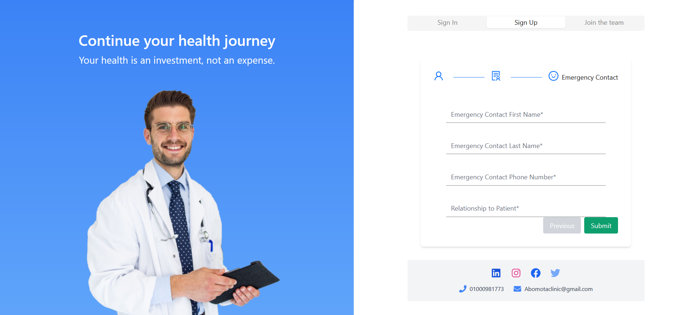
</details>

<details>
<summary>
<h3>
Doctor
</h3>
</summary>

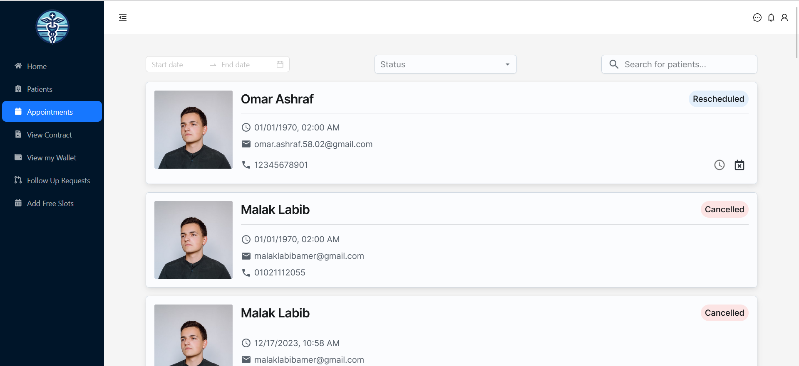
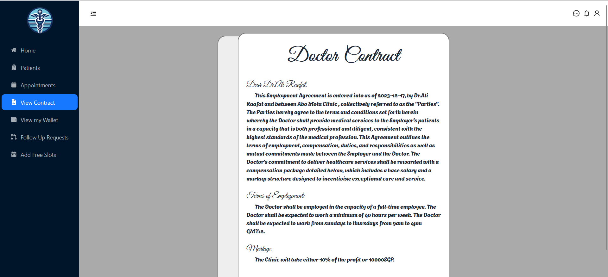
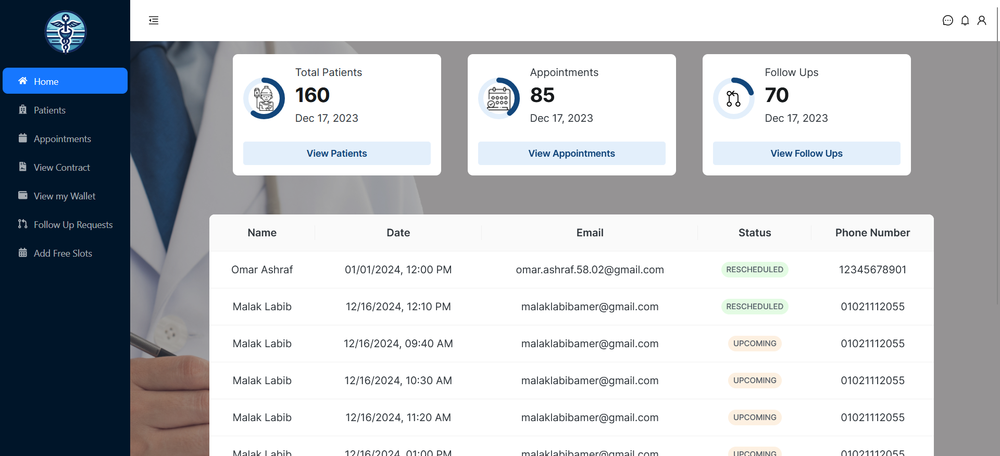
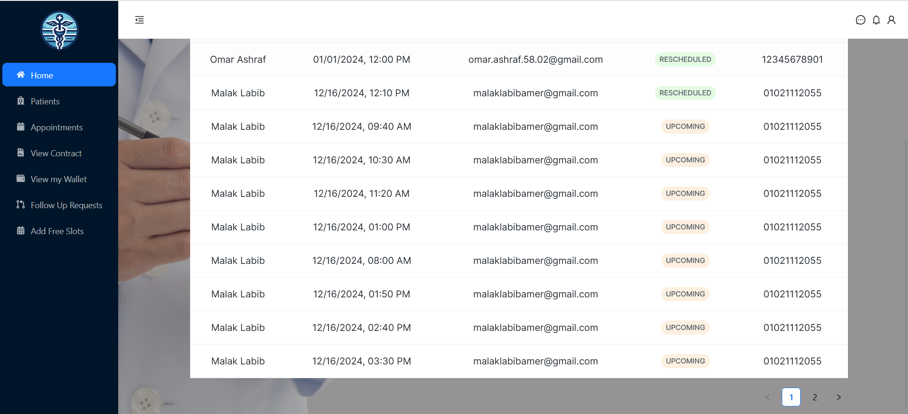
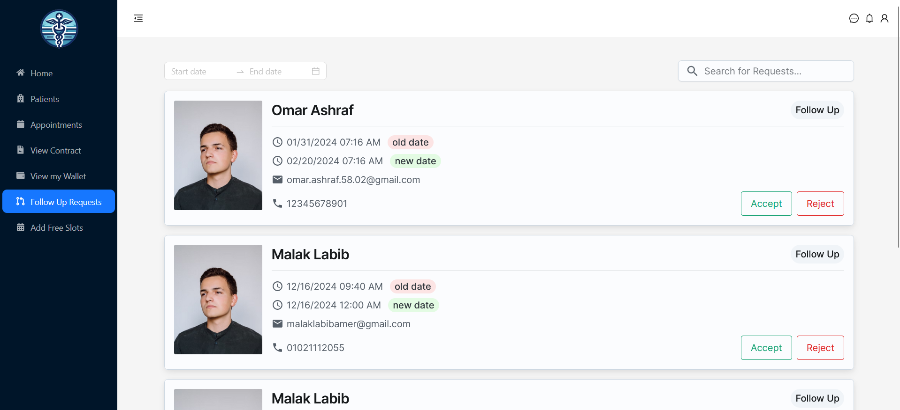
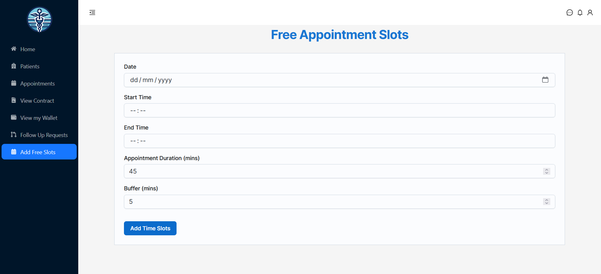
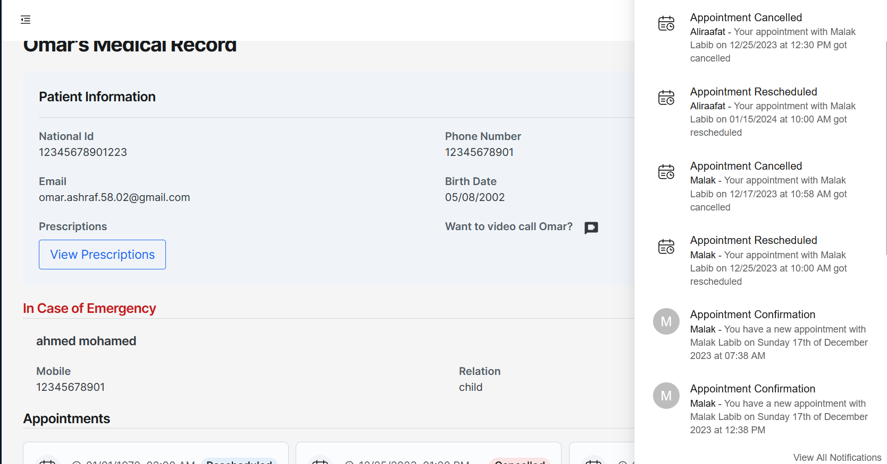
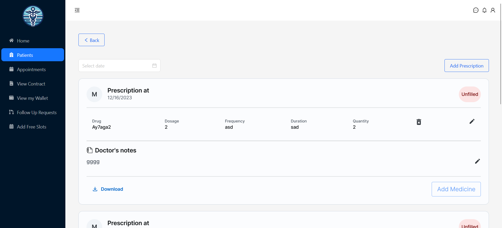
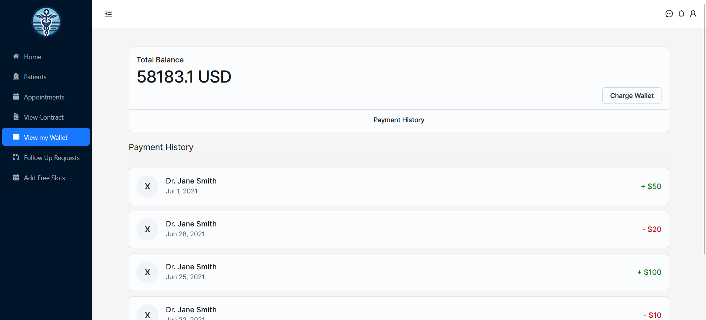
</details>

<details>
<summary>
<h3>
Patient
</h3>
</summary>
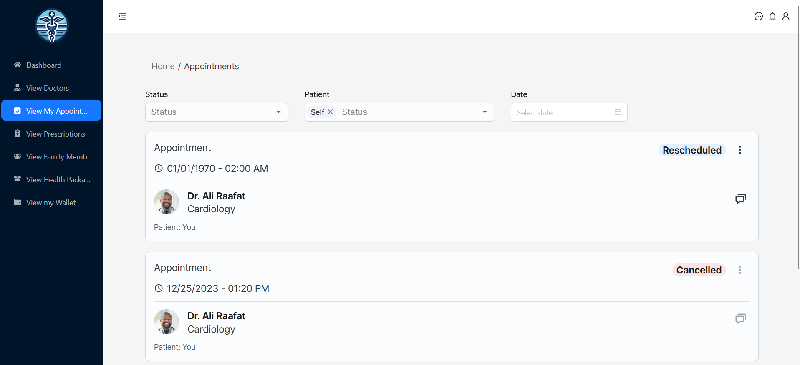
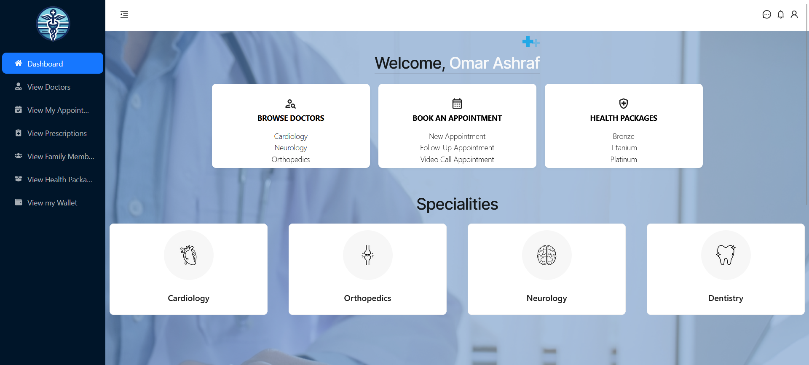

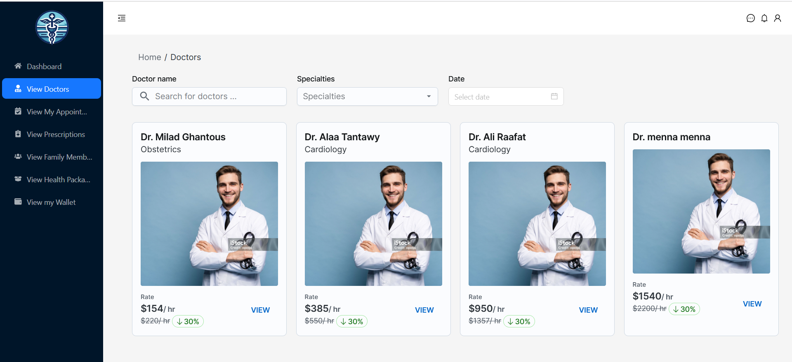
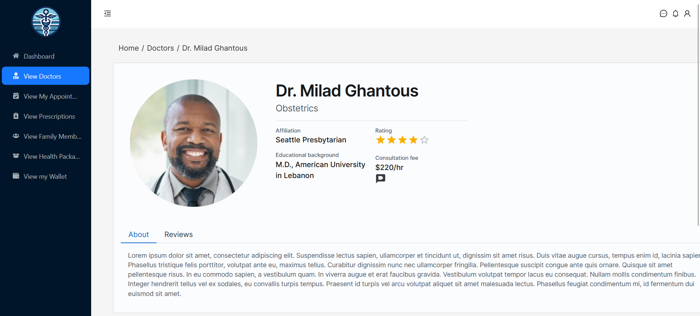
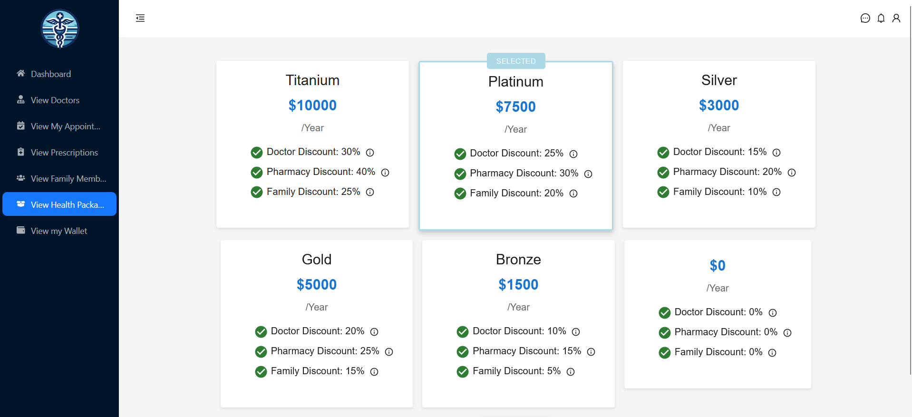
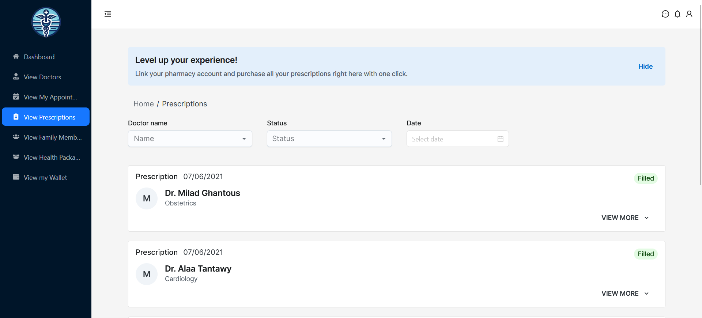
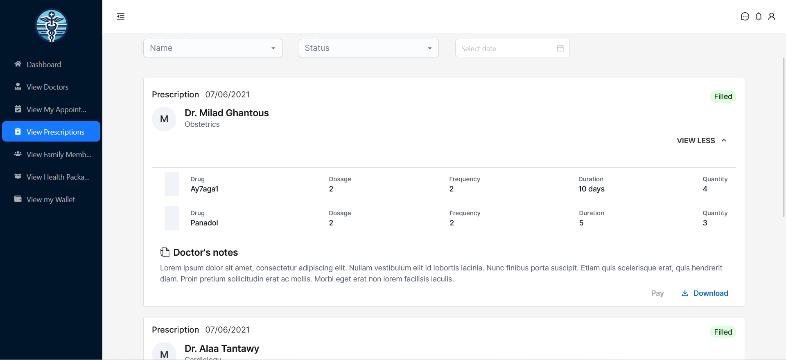
</details>

<details>
<summary>
<h3>Admin</h3>
</summary>
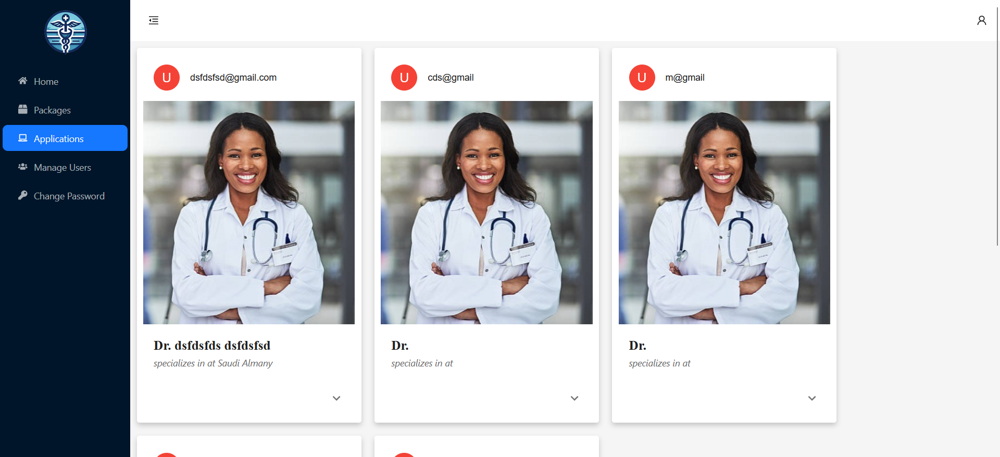
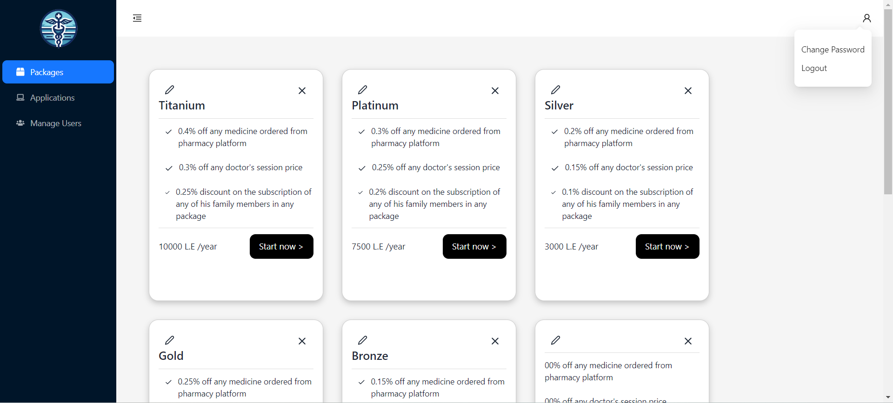
</details>

## Tech Stack

<div align="center" >
   
[](https://www.javascript.com)
[](https://html.com/html5/)


[](https://nodejs.org/en/)
[](https://GitHub.com/Naereen/badges/)
[](https://www.mongodb.com/)
[](https://github.com/omar-sherif9992)


</div>

- **Backend**: Node.js, Express, Mongoose, Socket.io, Nodemailer
- **Frontend**: React.js, Material-UI, Ant ,Redux , Socket.io, Tailwind
- **Database**: MongoDB
- **Authentication**: JWT
- **APIs**: Stripe
- **Development tools**: Postman, Git, GitHub

## Features

<details>
<summary>As a Guest I can</summary>

- Register as a patient with username, name, email, password, date of birth, gender, mobile number, and emergency contact.
- Submit a request to register as a doctor with username, name, email, password, date of birth, hourly rate, hospital affiliation, and educational background.
- Upload and submit required documents for doctor registration such as ID, medical licenses, and medical degree.

</details>

<details>
<summary>As a Patient I can</summary>

- Upload and remove my medical history documents.
- Add family members with their details.
- Link another patient's account as a family member.
- Pay for my appointment using my wallet or credit card.
- Enter credit card details and pay for an appointment using Stripe.
- View registered family members.
- View and filter appointments by date/status.
- View uploaded health records.
- Subscribe to health packages for myself and my family members.
- Choose payment methods for health packages.
- View the status and manage the subscription of my health care package.
- Cancel the subscription of a health package.
- View a list of all doctors with their specialty and session price.
- Search for doctors by name and/or specialty.
- Filter doctors by specialty and/or availability.
- Select a doctor from search/filter results and view their full details.
- View all available appointments of a selected doctor.
- Select an appointment date and time.
- View a list of all my upcoming and past appointments.
- Filter appointments by date or status.
- Reschedule an appointment.
- Cancel an appointment.
- Request a follow-up to a previous appointment.
- view all new and old prescriptions and their statuses (filled/ not filled)
- view health package options and details
- view subscribed health package for myself and my family members (if any)
- receive a notification of my appointment on the system and by mail
- Receive a refund in my wallet when an appointment is canceled.

</details>

<details>
<summary>As a Doctor I can</summary>

- Edit my email, hourly rate, or hospital affiliation.
- View and accept the employment contract.
- Add available time slots for appointments.
- View information and health records of patients registered with me.
- Search for a patient by name.
- Filter patients based on upcoming appointments.
- Select a patient from the list.
- Reschedule appointments for patients.
- Schedule follow-up for a patient.
- Add/delete medicine to/from the prescription from the pharmacy platform.
- Add/update dosage for each medicine added to the prescription.
- Add new health records for a patient.
- Add a patient's prescription.
- Update a patient's prescription before it's submitted to the pharmacy.
- Accept or revoke a follow-up session request from a patient.
- view information and health records of patient registered with me
- view a list of all my patients

</details>

<details>
<summary>As an Administrator I can</summary>

- Add another administrator with a set username and password.
- Remove a doctor/patient/administrator from the system.
- View all information uploaded by a doctor to apply to join the platform.
- Accept or reject the request of a doctor to join the platform.
- Add/update/delete health packages with different price ranges.

</details>
<details>
<summary>Common Features for Doctor/Patient</summary>
   
- View cart items and manage them.
- view all new and old prescriptions and their statuses (filled/ not filled)
- Pay directly for prescription items with wallet or credit card.
- Download selected prescription (PDF).
- Start/end a video call with the doctor/patient.
- View the amount in my wallet.
- Chat with a doctor/patient.
- view a list of all my upcoming / past appointments
- filter appointments by date or status.
- cancel an appointment for myself or for a family member
- receive a notification that my appointment is cancelled or rescheduled on the system and by mail
- receive a notification of my appointment on the system and by mail 
  
</details>

<details>
<summary>Common Features for Doctor/Patient/Administrator</summary>
   
- Login and logout of the system.
- Change my password.
- Reset a forgotten password through OTP sent to email.
</details>

## Code Examples

<details>
    <summary>
    Get Prescription Controller
    </summary>

```javascript
const getPrescriptions = async (req, res) => {
  try {
    const username = req.userData.username;
    const { _id } = await Patient.findOne({ username });
    const prescriptions = await Prescription.find({ patient: _id }).populate([
      {
        path: "medicines.medicine",
        model: "Medicine",
      },
      {
        path: "doctor",
        model: "Doctor",
      },
    ]);
    res.status(200).json(prescriptions);
  } catch (error) {
    res.status(500).json({ error: error.message });
  }
};
```

</details>

<details>
    
<summary>Appointments Model</summary>

```javascript
const mongoose = require("mongoose");
const { Schema } = mongoose;

const appointmentSchema = new Schema(
  {
    date: Date,
    status: {
      type: String,
      enum: ["completed", "upcoming", "cancelled", "unbooked", "rescheduled"],
      default: "unbooked",
    },
    doctor: {
      type: Schema.Types.ObjectId,
      ref: "Doctor",
    },
    patient: {
      type: Schema.Types.ObjectId,
      default: null,
      ref: "ClinicPatient",
    },
    pricePaid: {
      type: Number,
      default: null,
    },
  },
  { toJSON: { virtuals: true } }
);

const options = {
  year: "numeric",
  month: "2-digit",
  day: "2-digit",
  hour: "2-digit",
  minute: "2-digit",
  hour12: true,
};

appointmentSchema.virtual("formattedDate").get(function () {
  return new Intl.DateTimeFormat("en-US", options).format(this.date);
});

const Appointment = mongoose.model("Appointment", appointmentSchema);
module.exports = Appointment;
```

</details>

<details>

<summary>
    Admin Routes
</summary>

```javascript
const express = require("express");
const router = express.Router();
const {
  getPackages,
  updatePackage,
  addPackage,
  deletePackage,
  getApplications,
  getApplicationInfo,
  handleApplication,
  addAdmin,
  deleteAdmin,
  deletePatient,
  deleteDoctor,
  changePassword,
} = require("../controllers/adminController");
const authorize = require("../middlewares/authorization");

// View All Packages
router.get("/packages", authorize, getPackages);

// Update Package
router.patch("/packages/:id", authorize, updatePackage);

// Add Package
router.post("/packages", authorize, addPackage);

// Delete Package
router.delete("/packages/:id", authorize, deletePackage);

// Get all doctor applications
router.get("/applications", authorize, getApplications);

// View doctor application info
router.get("/applications/:id", authorize, getApplicationInfo);

// Handle doctor application
router.patch("/applications/:id", authorize, handleApplication);

// Add an admin
router.post("/admins", authorize, addAdmin);

// DELETES TBD IF PARAMS IN URL
// Delete a specific Admin
router.delete("/admins", authorize, deleteAdmin);

// Delete a specific patient
router.delete("/patients", authorize, deletePatient);

// Delete a specific doctor
router.delete("/doctors", authorize, deleteDoctor);

// Change Password
router.patch("/changePassword", authorize, changePassword);

module.exports = router;
```

</details>

<details>
    <summary>
        Authorization middleware
    </summary>

```javascript
const jwt = require("jsonwebtoken");

const authToken = (req, res, next) => {
  console.log("COOKIES", req.cookies);
  const token = req.cookies.jwt;

  if (token) {
    jwt.verify(token, process.env.JWT_SECRET, (err, userData) => {
      if (err)
        return res
          .status(404)
          .json({ message: "Unauthorized", isLoggedIn: false, error: err.message });

      req.userData = userData; //userData is the payload included in the token
      const userType = userData.userType;
      //check if the user type allowed for the current route

      if (userType === "admin" && req.baseUrl.includes("/admin")) {
        console.log("OKAY");
        next();
      } else if (
        userType === "doctor" &&
        (req.baseUrl.includes("/doctor") || req.baseUrl.includes("/common"))
      )
        next();
      else if (
        userType === "patient" &&
        (req.baseUrl.includes("/patient") ||
          req.baseUrl.includes("/stripe") ||
          req.baseUrl.includes("/common"))
      )
        next();
      else return res.status(403).json({ message: "Forbidden" });
    });
  } else {
    res.status(500).json({ message: "Unauthorized", isLoggedIn: false });
  }
};

module.exports = authToken;
```

</details>

<details>

<summary>  Patient Profile Page </summary>

```javascript
import PersonalInfoSection from "../components/PersonalInfoSection";
import EmergencyContactCard from "../components/EmergencyContactCard";
import FileUploadSection from "../../shared/pages/FileUploadSection";
import { useFetchPatientQuery } from "../../store";
import ChangePasswordSection from "../../shared/pages/ChangePasswordSection";

function Profile() {
  const { data, error, isFetching } = useFetchPatientQuery();

  return (
    <div className="bg-gray-100 p-8 w-full space-y-8">
      {isFetching || (
        <>
          <div className="max-w-6xl mx-auto bg-white rounded-lg shadow-md p-5">
            <div className="p-5 border-gray-200">
              <h2 className="text-xl font-bold text-gray-900">Patient Profile</h2>
            </div>
            <PersonalInfoSection patient={data} />
            <div className="flex flex-wrap -mx-3 md:mx-6">
              <div className="w-full md:w-1/2 px-3 md:px-6 py-4">
                <ChangePasswordSection isAdmin />
                <EmergencyContactCard patient={data} />
              </div>
              <div className="w-full md:w-1/2 px-3 md:px-6 py-4">
                <FileUploadSection files={data.medicalHistory} medicalHistory />
                <FileUploadSection files={data.healthRecords} />
              </div>
            </div>
          </div>
        </>
      )}
    </div>
  );
}

export default Profile;
```

</details>

<details>

<summary>
   App sidebar
</summary>

```javascript
import { Sidebar, Menu, MenuItem, SubMenu } from "react-pro-sidebar";
import { Link } from "react-router-dom";

export default function SideBar({ open, links }) {
  // Assuming the navbar height is set as a CSS variable --navbar-height
  const sidebarStyle = {
    height: `calc(100vh - var(--navbar-height))`, // Adjust var(--navbar-height) accordingly
    overflowY: "auto", // Add scroll to sidebar if contents exceed its height
  };

  return (
    <div style={sidebarStyle}>
      <Sidebar
        collapsedWidth="0px"
        collapsed={!open}
        backgroundColor="var(--primary-color-very-dark)"
      >
        <div style={{ padding: "1rem", display: "flex", alignItems: "center" }}>
          <h2 className="text-[var(--text-color-primary)] font-semibold">Abo Mota Clinic</h2>
        </div>
        <Menu
          closeOnClick={true}
          className="text-white"
          menuItemStyles={{
            button: ({ level, active, disabled }) => {
              if (level === 0)
                return {
                  color: disabled ? "#f5d9ff" : "#FFFFFF",
                  backgroundColor: active ? "#232232" : undefined,
                  ":hover": {
                    backgroundColor: "#add8e6",
                    color: "#000000",
                  },
                };
            },
          }}
        >
          {links.map((link, index) => {
            return (
              <Link key={index} to={link.to}>
                <MenuItem icon={link.logo}>{link.name}</MenuItem>
              </Link>
            );
          })}
        </Menu>
      </Sidebar>
    </div>
  );
}
```

</details>

<details>

   <summary>
        Login Form
   </summary> 
   
```javascript
import KimoButton from "../../Components/KimoButton";
import { useEffect, useState } from "react";
import Input from "../../Components/InputField";
import logo from "../../../shared/assets/logo.png";
import * as yup from "yup";
import { Formik } from "formik";
import LoadingIndicator from "../../Components/LoadingIndicator";
import { useNavigate } from "react-router-dom";
import "./styles.css";
import { useLoginMutation, login } from "../../../store";
import ForgetPasswordScreen from "../ForgetPasswordScreen";
import OtpScreen from "../OtpScreen";
import { useDispatch } from "react-redux";
import FormErrorDialog from "../../Components/FormErrorDialog";

const LoginForm = () => {
const [isLoading, setIsLoading] = useState(false);
const [forgetPassword, setForgetPassword] = useState(false);
const [otpOpen, setOtpOpen] = useState(false);
const navigate = useNavigate();
const [loginMutation, results] = useLoginMutation();
const dispatch = useDispatch();
const [email, setEmail] = useState("");
const [isError, setIsError] = useState(false);

useEffect(() => {
if (results.isError) {
setIsError(true);
}
}, [results]);

const handleSubmit = async (values, { resetForm }) => {
const user = {
username: values.username,
password: values.password,
};

    setIsLoading(true);
    await new Promise((resolve) => setTimeout(resolve, 1000));

    try {
      const result = await loginMutation(user).unwrap();
      console.log(result);
      // Use the result for navigation or other side effects
      if (result.userType === "patient") {
        dispatch(login({ role: "patient" })); // Dispatch login action with role
        navigate("/patient");
      } else if (result.userType === "doctor") {
        dispatch(login({ role: "doctor" })); // Dispatch login action with role
        navigate("/doctor");
      } else if (result.userType === "admin") {
        dispatch(login({ role: "admin" })); // Dispatch login action with role
        navigate("/admin");
      }
      resetForm({ values: "" });
    } catch (error) {
      console.error("Failed to login:", error);
    } finally {
      setIsLoading(false);
    }

};

const forgetPasswordOnClick = () => {
console.log("forget password");
};

const UserForm = (
<Formik
      initialValues={initialUserValues}
      validationSchema={UserSchema}
      onSubmit={handleSubmit}
    >
{(formik) => (

<form onSubmit={formik.handleSubmit}>
<div className='form-container'>
<Input
label='Username*'
icon
type='text'
id='username'
error={formik.errors.username}
touch={formik.touched.username}
{...formik.getFieldProps("username")}
/>
</div>
<div className='form-container'>
<Input
label='Password*'
icon
type='password'
id='password'
error={formik.errors.password}
touch={formik.touched.password}
{...formik.getFieldProps("password")}
/>
</div>
<div className='submit-add-medicine-button-container'>
{
isLoading ? (
<LoadingIndicator />
) : (
// <Link to='medicine'>
<KimoButton type='submit'>Log in</KimoButton>
)
// </Link>
}
</div>
</form>
)}
</Formik>
);

return (

<div className='login-div'>
<div className='login-portal'>
<div className='login-part'>
<div className='login-logo-div'>
{" "}
{" "}
</div>
{/_ <Header header="Welcome Back!" type="login-header" /> _/}
</div>
<p className='login-word'>Login</p>
{UserForm}
<div className='flex justify-between mr-8 ml-8'>
<div className='flex space-x-4'>
<button
className='forget-password-button'
onClick={() => {
navigate("/doctorRegistration");
}} >
Register as Doctor?
</button>
<button
className='forget-password-button'
onClick={() => {
navigate("/patientRegistration");
}} >
Register as Patient?
</button>
</div>
<button
className='forget-password-button'
onClick={() => {
setForgetPassword(true);
}} >
Forget Password?
</button>
</div>
</div>
{forgetPassword && (
<ForgetPasswordScreen
closeForm={() => {
setForgetPassword(false);
}}
goToOtp={() => {
setOtpOpen(true);
}}
setEmail={setEmail}
/>
)}
{otpOpen && (
<OtpScreen
closeForm={() => {
setOtpOpen(false);
}}
email={email}
/>
)}
<FormErrorDialog
isError={isError}
setClose={() => {
setIsError(false);
}}
/>
</div>
);
};

const UserSchema = yup.object().shape({
username: yup
.string("Invalid username")
.required("Please enter a valid username"),

password: yup
.string()
.min(8, "Password must be at least 8 characters long")
.matches(/[a-zA-Z]/, "Password must contain at least one letter")
.matches(/[0-9]/, "Password must contain at least one number")
.required("Please enter a valid password"),
});

const initialUserValues = {
username: "",
password: "",
};

export default LoginForm;

````

</details>


## Installation

### Clone the repository:

   ```bash
   git clone https://github.com/advanced-computer-lab-2023/Abo-Mota-Clinic.git
   cd Abo-Mota-Clinic
````

### Install client dependencies

```bash
cd client
npm install
```

### Install server dependencies

```bash
  cd backend
  npm install
```

## API Reference

Check out our API Documentation on Postman by clicking [here](https://documenter.getpostman.com/view/28691126/2s9Ykn81p5).

<details>
<summary><h3>Guest Routes</h3></summary>

#### Register Patient

- **Endpoint**: `POST /api/guest/registerPatient`
- **Description**: Registers a new patient.
- **Controller**: `registerPatient`
  - Handles patient registration.
- **Body Parameters**:
  | Parameter | Type | Description |
  |-------------|--------|----------------|
  | `name` | string | Patient's name |
  | `username` | string | User's username|
  | `nationalId`| string | National ID |
  | `password` | string | Account password|
  | `email` | string | Email address |
  | `dob` | date | Date of Birth |
  | `mobile` | number | Phone Number |
  | `gender` | string | Gender (male or female) |
  | `emergencyContact.name` | string | Emergency contact's name |
  | `emergencyContact.mobile` | string | Emergency contact's mobile |
  | `emergencyContact.relation` | string | Relation to emergency contact |

#### Register Doctor

- **Endpoint**: `POST /api/guest/registerDoctor`
- **Description**: Registers a new doctor with file uploads for credentials.
- **Controller**: `registerDoctor`
  - Manages doctor registration and file uploads.
- **Body Parameters**:
  | Parameter | Type | Description |
  |-------------|--------|-------------------|
  | `name` | string | Patient's name |
  | `username` | string | User's username|
  | `nationalId`| file | National ID File |
  | `password` | string | Account password|
  | `email` | string | Email address |
  | `dob` | date | Date of Birth |
  | `specialty` | string | Specialty like (heart, etc.)|
  | `educationalBackground` | string | Educational Background|
  | `affiliation` | string | Affiliation of Dr. |
  | `specialty` | string | Specialty of Dr. |
  | `mobile` | number | Phone Number |
  | `gender` | string | Gender (male or female) |
  | `medicalLicense`| file| Medical license file|
  | `medicalDegree`| file | Medical degree file|

#### Request OTP

- **Endpoint**: `POST /api/guest/otp`
- **Description**: Requests a new OTP for password reset.
- **Controller**: `requestOtp`
  - Requests OTP for password reset.
- **Body Parameters**:  
  | Parameter | Type | Description |
  |-------------|--------|----------------|
  | `email` | string | Email address |

#### Forgot Password

- **Endpoint**: `POST /api/guest/forgotPassword`
- **Description**: Reset forgotten passwords.
- **Controller**: `forgotPassword`
  - Resets forgotten passwords.
- **Body Parameters**:
  | Parameter | Type | Description |
  |-------------|--------|----------------|
  | `email` | string | Email address |
  | `otp` | string | OTP code |
  | `newPassword`| string| New password |

#### Login

- **Endpoint**: `POST /api/guest/login`
- **Description**: Authenticates a user and logs them in.
- **Controller**: `login`
  - Handles user login.
- **Body Parameters**:
  | Parameter | Type | Description |
  |-------------|--------|----------------|
  | `username` | string | User's username|
  | `password` | string | Account password|

#### Logout

- **Endpoint**: `POST /api/guest/logout`
- **Description**: Logs out the current user.
- **Controller**: `logout`
  - Logs out the user.

</details>

<details>
   <summary><h3>Stripe Routes</h3></summary>
   
   #### Get Configurations
- **Endpoint**: `GET /api/stripe/config`
- **Description**: Retrieves Stripe configuration details.
- **Controller**: `config`
  - Returns Stripe publishable key.

#### Create Payment Intent

- **Endpoint**: `POST /api/stripe/create-payment-intent`
- **Description**: Creates a new payment intent for Stripe transactions.
- **Controller**: `createPaymentIntent`
  - Stripe Payment Intent Creation.
- **Body Parameters**:
  | Parameter | Type | Description |
  |---------------|--------|---------------------------|
  | `beneficiary` | string | Description of beneficiary|
  | `amount` | number | Transaction amount in USD |

</details>

<details>
   <summary><h3>Common Routes (Notifications and Messages)</h1></summary>
   
   #### Get Messages
- **Endpoint**: `GET /api/common/message`
- **Description**: Retrieves messages for a user and certain recipient.
- **Controller**: `getMessages`
  - Retrieves user-specific messages based on username and recipient. 
- **Query Parameters**: 
  | Parameter    | Type   | Description              |
  |--------------|--------|--------------------------|
  | `recipient`  | string | Id of the recipient|

#### Send Message

- **Endpoint**: `POST /api/common/message`
- **Description**: Sends a new message.
- **Controller**: `sendMessage`
  - Sends messages from users, storing sender and recipient info.
- **Body Parameters**:
  | Parameter | Type | Description |
  |--------------|--------|--------------------------|
  | `content` | string | Message content |
  | `recipient` | string | Id of the recipient|

#### Get Notifications

- **Endpoint**: `GET /api/common/notifications`
- **Description**: Retrieves notifications for a user.
- **Controller**: `getNotifications`
  - Retrieves all notifications for a user.

#### Send Notification

- **Endpoint**: `POST /api/common/notification`
- **Description**: Sends a new notification.
- **Controller**: `sendNotification`
  - Creates and sends notifications to specified recipients.
- **Body Parameters**:
  | Parameter | Type |Description |
  |-------------------|--------|---------------------------|
  | `recipientUsername`| string | Recipient's username |
  | `recipientType` | string | Recipient's user type |
  | `content` | string | Notification content |

#### Send Email Notification

- **Endpoint**: `POST /api/common/send-email`
- **Description**: Sends an email notification.
- **Controller**: `sendEmailNotif`
  - Sends email notifications using external email service.
- **Body Parameters**:
  | Parameter | Type | Description |
  |--------------|--------|---------------------------|
  | `email` | string | Recipient email address |
  | `subject` | string | Email subject |
  | `text` | string | Email body text |

#### Get Logged In User

- **Endpoint**: `GET /api/common/loggedIn`
- **Description**: Retrieves information of the logged-in user.
- **Controller**: `getLoggedIn`
  - Retrieves currently logged-in user's details.

#### Get Recipient

- **Endpoint**: `GET /api/common/recipient`
- **Description**: Retrieves recipient details.
- **Controller**: `getRecipient`
  - Fetches details of a specified recipient based on ID.
- **Query Parameters**:
  | Parameter | Type | Description |
  |--------------|--------|---------------------------|
  | `recipientId`| string | ID of the recipient |

#### Get Contacted Users

- **Endpoint**: `GET /api/common/contacts`
- **Description**: Retrieves users that have been contacted.
- **Controller**: `getContactedUsers`
  - Retrieves users that have been in contact with the requester.
  </details>

<details>
   <summary><h3>Admin Routes</h3></summary>
   
   #### Get Packages
- **Endpoint**: `GET /api/admin/packages`
- **Description**: Fetches available health packages.
- **Controller**: `getPackages`
  - Retrieves all active health packages.
#### Update Package
- **Endpoint**: `PATCH /api/admin/packages/:id`
- **Description**: Modifies an existing package.
- **Controller**: `updatePackage`
  - Updates specific health package details.
- **Path Parameters (Params)**: 
  | Parameter | Type   | Description         |
  |-----------|--------|---------------------|
  | `id`      | string | Package identifier  |

#### Add Package

- **Endpoint**: `POST /api/admin/packages`
- **Description**: Creates a new package.
- **Controller**: `addPackage`
  - Adds a new health package.

#### Delete Package

- **Endpoint**: `DELETE /api/admin/packages/:id`
- **Description**: Deactivates a package.
- **Controller**: `deletePackage`
  - Soft deletes a health package.
- **Path Parameters (Params)**:
  | Parameter | Type | Description |
  |-----------|--------|---------------------|
  | `id` | string | Package identifier |

#### Get Applications

- **Endpoint**: `GET /api/admin/applications`
- **Description**: Retrieves all pending doctor applications.
- **Controller**: `getApplications`
  - Fetches all pending doctor applications.

#### View Application Info

- **Endpoint**: `GET /api/admin/applications/:id`
- **Description**: Fetches details of a pending doctor application.
- **Controller**: `getApplicationInfo`
  - Views specific pending doctor application details.
- **Path Parameters (Params)**:
  | Parameter | Type | Description |
  |-----------|--------|------------------------------|
  | `id` | string | Doctor identifier |

#### Handle Application

- **Endpoint**: `PATCH /api/admin/applications/:id`
- **Description**: Manages a doctor application.
- **Controller**: `handleApplication`
  - Approves or rejects doctor applications.
- **Path Parameters (Params)**:
  | Parameter | Type | Description |
  |-----------|--------|------------------------------|
  | `id` | string | Application identifier |
- **Body Parameters**:
  | Parameter | Type | Description |
  |-----------|--------|------------------------------|
  | `registrationStatus` | string | status of doctor's application|

#### Add Admin

- **Endpoint**: `POST /api/admin/admins`
- **Description**: Creates an admin account.
- **Controller**: `addAdmin`
  - Registers a new admin user.
- **Body Parameters**:
  | Parameter | Type | Description |
  |-----------|--------|------------------------------|
  | `username` | string | Username of added admin |
  | `password` | string | Password of added admin|
  | `email` | string | Email of added admin|

#### Delete Admin

- **Endpoint**: `DELETE /api/admin/admins`
- **Description**: Deletes an admin user.
- **Controller**: `deleteAdmin`
  - Removes an admin user.
- **Body Parameters**:
  | Parameter | Type | Description |
  |-----------|--------|------------------------------|
  | `username` | string | Username of removed admin|

#### Delete Doctor

- **Endpoint**: `DELETE /api/admin/doctors`
- **Description**: Deletes an approved doctor user.
- **Controller**: `deleteDoctor`
  - Removes an approved doctor user.
- **Body Parameters**:
  | Parameter | Type | Description |
  |-----------|--------|------------------------------|
  | `username` | string |Username of removed doctor|

#### Delete Patient

- **Endpoint**: `DELETE /api/admin/patients`
- **Description**: Deletes a patient user.
- **Controller**: `deletePatient`
  - Removes a patient user.
- **Body Parameters**:
  | Parameter | Type | Description |
  |-----------|--------|------------------------------|
  | `username` | string |Username of removed patient|

#### Change Password

- **Endpoint**: `PATCH /api/admin/changePassword`
- **Description**: Updates logged in admin's password.
- **Controller**: `changePassword`
  - Changes admin user's password.
- **Body Parameters**:
| Parameter | Type | Description |
|-----------|--------|------------------------------|
| `oldPassword` | string | Old password of current admin|
| `newPassword` | string | New password of current admin|
</details>

<details>
   <summary>
      <h3>
         Doctor Routes
      </h3>
   </summary>
   
   #### Get Doctor Profile
- **Endpoint**: `GET /api/doctor`
- **Description**: Retrieve the profile of the currently logged in doctor
- **Controller**: `getDoctorProfile`
  - Returns doctor user object

#### Edit Account details

- **Endpoint**: `PATCH /api/doctor`
- **Description**: Edit email, rate or affiliation
- **Controller**: `editDetails`
  - Updates logged in doctor's email, rate and affiliation
- **Body Parameters**:
  | Parameter | Type | Description |
  |-----------|--------|------------------------------|
  | `email` | string | New email of logged in doctor|
  | `rate` | number | New rate of logged in doctor|
  | `affiliation` | string | New affiliation of logged in doctor|

#### Get Doctor's Appointments

- **Endpoint**: `GET /api/doctor/appointments`
- **Description**: Retrieve all appointments of currently logged in doctor
- **Controller**: `getDoctorAppointments`
  - Returns array of all logged in doctor's appointment objects

#### Get Doctor's patients

- **Endpoint**: `GET /api/doctor/patients`
- **Description**: Retrieve all patients who have or have had appointments with the logged in doctor
- **Controller**: `getDoctorPatients`
  - Retrieves an array of objects containing all patients who have had or appointments with the logged in doctor

#### Upload Health Record

- **Endpoint**: `POST /api/doctor/uploadHealthRecord`
- **Description**: Upload health records of a certain patient
- **Controller**: `uploadHealthRecords`
  - Uploads health record file for a given patient
- **Body Paramaters**:
  | Parameter | Type | Description |
  |-----------|--------|------------------------------|
  | `username` | string | Username of patient we wish to upload health record to|
  | `healthRecord` | file | Health record file we wish to upload|

#### Change Password

- **Endpoint**: `PATCH /api/doctor/changePassword`
- **Description**: Changes current logged in doctor's password
- **Controller**: `changePassword`
  - Edit password in logged in doctor's account
- **Body Parameters**:
  | Parameter | Type | Description |
  |-----------|--------|------------------------------|
  | `oldPassword` | string | Current password of logged in doctor|
  | `newPassword` | string | Requested new password|

#### Add Free Appointment Slots

- **Endpoint**: `POST /api/doctor/addFreeAppointmentSlots`
- **Description**: Create free appointments slots for logged in doctor
- **Controller**: `addFreeAppointmentSlots`
  - Creates free appointments slots based on doctor's requester
- **Body Parameters**:
  | Parameter | Type | Description |
  |-----------|--------|------------------------------|
  | `date` | date | Date of the appointments slots|
  | `startTime`| string | Starting time of first appointment slot |
  | `endTime` | string | End time of last appointment slot|
  | `appointmentDuration`| number | Duration of each appointment slot in minutes|
  | `buffer`| number | Time between each appointment slot in minutes|

#### Accept Contract

- **Endpoint**: `PATCH /api/doctor/acceptContract`
- **Description**: Accept contract offer from platform to logged in doctor
- **Controller**: `acceptContract`
  - Sets contract to approved in logged in doctor's account

#### Schedule Follow Up Appointment

- **Endpoint**: `POST /api/doctor/scheduleFollowUp`
- **Description**: Schedule follow up appointment for a given patient
- **Controller**: `scheduleFollowUp`
  - Creates a follow up appointment for a given patient
- **Body Parameters**:

| Parameter         | Type   | Description                      |
| ----------------- | ------ | -------------------------------- |
| `patientUsername` | string | Follow up appointment's patient  |
| `followUpDate`    | date   | Date and time of the appointment |

#### View Wallet

- **Endpoint**: `GET /api/doctor/wallet`
- **Description**: Retrieves balance in wallet of logged in doctor
- **Controller**: `viewWallet`
  - Returns amount in logged in doctor's wallet

#### Get All Medicines

- **Endpoint**: `GET /api/doctor/medicines`
- **Description**: Retrieves all medicines that are or were available in the pharmacy
- **Controller**: `getAllMedicines`
  - Returns an array of all medicine objects

#### Get Prescriptions

- **Endpoint**: `GET /api/doctor/prescriptions`
- **Description**: Retrieves all prescriptions written by logged in doctor belonging to a specific patient
- **Controller**: `viewPrescriptions`
  - Returns all prescriptions belonging to patient specified in query parameters
- **Query Parameters**:
  | Parameter | Type | Description |
  |-----------|--------|------------------------------|
  | `patientId` | string | ObjectID of patient document we wish to retrieve prescriptions for |

#### Reschedule Patient Appointment

- **Endpoint**: `POST /api/doctor/rescheduleAppointment`
- **Description**: Change the date and time of a specific patients appointment
- **Controller**: `reschedulePatientAppointment`
  - Changes the date and time of a given appointment
- **Body Parameters**:
  | Parameter | Type | Description |
  |-----------|--------|------------------------------|
  | `appointmentId` | string | ObjectID of appointment we wish reschedule |
  | `newDate`| date | Date and time we wish to reschedule appointment to|

#### Cancel Appointment

- **Endpoint**: `PATCH /api/doctor/cancelAppointments`
- **Description**: Cancels a given appointment belonging to the logged in doctor
- **Controller**: `cancelAppointment`
  - Cancels a specific appointment
- **Body Parameters**:
  | Parameter | Type | Description |
  |-----------|-------- |------------------------------|
  | `appointmentID` | string | ObjectID of appointment to be cancelled |

#### Add Medicine To Prescription

- **Endpoint**: `PATCH /api/doctor/addMedToPrescription`
- **Description**: Adds a given medicine and its usage information to a patient's prescription
- **Controller**: `addMedicineToPrescription`
  - Adds a medicine to a patient's prescription
- **Body Parameters**:
  | Parameter | Type | Description |
  |-----------|--------|------------------------------|
  | `prescriptionId` | string | ObjectID of prescription document to be edited|
  | `medicineName`| string | Name of the medicine to be added |
  | `dosage` | number | Dosage of the medicine to be added |
  | `frequency`| string | How frequently patient should consume the medicine|
  | `duration`| string | How long the patient should take the medicine|

#### Delete Medicine From Prescription

- **Endpoint**: `PATCH /api/doctor/deleteMedFromPrescription`
- **Description**: Deletes a given medicine from a patient's prescription
- **Controller**: `deleteMedicineFromPrescription`
  - Deletes a medicine by given name from the prescription
- **Body Parameters**:
  | Parameter | Type | Description |
  |-----------|--------|------------------------------|
  | `prescriptionId` | string | ObjectID of prescription we wish to delete from |
  | `medicineName`| string | Name of medicine we wish to delete|

#### Update Medicine in Prescription

- **Endpoint**: `PATCH /api/doctor/updateMedInPrescription`
- **Description**: Edits medicine details within a given prescription
- **Controller**: `updateMedicineInPrescription`
  - Updates the details of a given medicine within a patient's prescription
- **Body Parameters**:
  | Parameter | Type | Description |
  |-----------|--------|------------------------------|
  | `prescriptionId` | string | ObjectID of prescription document to be edited|
  | `name`| string | Name of the medicine to be edited |
  | `dosage` | number | Dosage of the medicine |
  | `frequency`| string | How frequently patient should consume the medicine|
  | `duration`| string | How long the patient should take the medicine|

#### Add Prescriptions

- **Endpoint**: `POST /api/doctor/addPrescription`
- **Description**: Upload prescription to Database
- **Controller**: ``addPrescription`
  - Creates prescription document with given body parameters
- **Body Parameters**:
  | Parameter | Type | Description |
  |-----------|--------|------------------------------|
  | `medicines` | array | Array of objects representing medicine and consumption details|
  | `description`| string | Descriptions or extra reminders written by the doctor in the prescription|
  | `patient` | string | ObjectID of patient who owns this prescription |

#### Update Prescription Description

- **Endpoint**: `PATCH /api/doctor/updateDescription`
- **Description**: Edit description within a patient's prescription
- **Controller**: `updatePrescriptionDesc`
  - Changes description within a prescription document
- **Body Paramaters**:
  | Parameter | Type | Description |
  |-----------|--------|------------------------------|
  | `description` | string | Description in prescription document |
  | `prescriptionId`| string | ObjectID of prescription to be edited|

#### Get Follow Up Requests

- **Endpoint**: `GET /api/doctor/followUps`
- **Description**: Retrieves follow up requests sent by patients of the logged in doctor
- **Controller**: `getFollowUpRequests`
  - Retrieves follow up documents of a certain patient and with the logged in doctor's ID

#### Handle Follow Up Request

- **Endpoint**: `POST /api/doctor/handleFollowUp`
- **Description**: Accept or revoke an incoming follow up request sent by a patient to the logged in docto
- **Controller**: `handleFollowUpRequest`
  - Deletes or accepts follow up request document and schedules new appointment if accepted
- **Body Parameters**:
  | Parameter | Type | Description |
  |-----------|--------|------------------------------|
  | `followUpId` | string | Follow up request ObjectId |
  | `choice`| string | The choice of the doctor, can be either "accept" or "revoke"|

</details>

<details>
   <summary>
      <h3>
         Patient Routes
      </h3>
   </summary>
   
   #### Get Logged In Patient

- **Endpoint**: `GET /api/patient/`
- **Description**: Retrieves logged in patient information
- **Controller**: `getPatient`
  - Fetches logged in patient's account object

#### Get Logged In Patient's Prescriptions

- **Endpoint**: `GET api/patient/prescriptions`
- **Description**: Retrieves all prescriptions belonging to logged in patient
- **Controller**: `getPrescriptions`
  - Returns array of prescriptions belonging to the logged in patient

#### Get Family Members

- **Endpoint**: `GET /api/patient/family`
- **Description**: Retrieves all family members linked to logged in patient
- **Controller**: `getFamilyMembers`
  - Returns array of family members along with their relation to the logged in patient

#### Add Family Members

- **Endpoint**: `POST /api/patient/family`
- **Description**: Register logged in patient's family member on the platform
- **Controller**: `addFamilyMember`
  - Registers a family member to the platform and links them to the logged in patient
- **Body Parameters**:
  | Parameter | Type | Description |
  |-----------|--------|------------------------------|
  | `name` | string | Name of family member |
  | `email`| string | Email of family member|
  | `nationalId`| string | National ID of family member|
  | `age`| number | Age of family member|
  | `gender`| string | Gender of the family member, either "male" or "female"|
  | `relationToPatient`| string | Relation to the logged in patient, either "wife", "husband" or "child"|
  | `phoneNumber`| string | Family Member's phone number|
  | `username`| string | Family member's username|
  | `password`| string | Family member's password|
  | `dob`| date | Family member's date of birth|

#### Get Doctors

- **Endpoint**: `GET /api/patient/doctors`
- **Description**: Retrieve all approved doctor on the platform
- **Controller**: `getDoctors`
  - Returns an array of all doctors on the platform who have been approved and accepted their contract

#### Get Appointments

- **Endpoint**: `GET /api/patient/appointments`
- **Description**: Retrieve all logged in patient's appointments
- **Controller**: `getAppointments`
  - Returns an array of all appointments belonging to the logged in patient

#### Upload Medical History

- **Endpoint**: `POST /api/patient/uploadMedicalHistory`
- **Description**: Upload medical history file to logged in patient's account
- **Controller**: `uploadMedicalHistory`
  - Uploads medical history file to patient's document in Database
- **Body Parameters**:
  | Parameter | Type | Description |
  |-----------|--------|------------------------------|
  | `medicalHistory` | file | Medical history file |

#### Delete Medical History

- **Endpoint**: `PATCH /api/patient/deleteMedicalHistory/:id`
- **Description**: Deletes a specific medical history file from account of logged in patient
- **Controller**: `deleteMedicalHistory`
  - Deletes medical history based on id passed in Params
- **Path Parameters (Params)**
  | Parameter | Type | Description |
  |-----------|--------|------------------------------|
  | `id` | string | Medical history file identifier |

#### Change Password

- **Endpoint**: `PATCH /api/patient/changePassword`
- **Description**: Change password of logged in patient
- **Controller**: `changePassword`
  - Edits password of logged in patient and restores hashed version in Database
- **Body Parameters**:
  | Parameter | Type | Description |
  |-----------|--------|------------------------------|
  | `oldPassword` | string | Current logged in patient's password |
  | `newPassword` | string | New password |

#### Get all Health Packages

- **Endpoint**: `GET /api/patient/packages`
- **Description**: Retrieves all available health packages on the platform
- **Controller**: `getPackages`
  - Returns an array of all activated packages on the platform

#### Get Available Appointments

- **Endpoint**: `GET /api/patient/availableAppointments`
- **Description**: Retrieves all available appointments belonging to a certain doctor based on the query string
- **Controller**: `getAvailableAppointment`
  - Uses doctorId in query string to retrieve all available appointments of that doctor
- **Query Parameters**:
  | Parameter | Type | Description |
  |-----------|--------|------------------------------|
  | `doctorId` | string | ObjectId of a specific doctor in the database |

#### Link Family Member

- **Endpoint**: `POST /api/patient/linkFamily`
- **Description**: Link a family member's account to the logged in patient's account
- **Controller**: `linkFamilyMember`
  - Links family member's account to patient's and vice versa
- **Body Parameters**:
  | Parameter | Type | Description |
  |-----------|--------|------------------------------|
  | `email` | string | Email of family member (Either this or mobile) |
  | `mobile` | string| Phone Number of family member (Either this or email) |
  | `relationToPatient` | string | Family member's relation to patient, either "wife", "husband" or "child" |

#### Pay by wallet

- **Endpoint**: `POST /api/patient/payWallet`
- **Description**: Subtracts deductible amount from logged in patient's wallet
- **Controller**: `payByWallet`
  - Decrements wallet balance of logged in patient by deductible in body
- **Body Parameters**:
  | Parameter | Type | Description |
  |-----------|--------|------------------------------|
  | `deductible` | number | Amount to be deducted from logged in patient's wallet |

#### Credit Doctor

- **Endpoint**: `PATCH /api/patient/creditDoctor`
- **Description**: Credit doctor's wallet with credit amount in body
- **Controller**: `creditDoctor`
  - Credits a given doctor's wallet depending on the id in the body
- **Body Parameters**:
  | Parameter | Type | Description |
  |-----------|--------|------------------------------|
  | `doctor_id` | string | ObjectId of doctor to credit |
  | `credit` | number | Amount to add to doctor's wallet|

#### Subscribe to health package

- **Endpoint**: `POST /api/patient/subscribe`
- **Description**: Subscribes receiver patient to a specific health package
- **Controller**: `subscribeToHealthPackage`
  - Subscribes a specific patient to a health package depending on the receiver ID passed in the body
- **Body Parameters**:
  | Parameter | Type | Description |
  |-----------|--------|------------------------------|
  | `_id` | string | ObjectId of package we wish to subscribe to |
  | `receiverId` | string | ObjectID of patient who will receive the health package |

#### Get My Health Package

- **Endpoint**: `GET /api/patient/myPackage`
- **Description**: Retrieves logged in patient's subscribed health package if it exists
- **Controller**: `getMyPackage`
  - Returns logged in patient's subscribed health package information

#### Get Family Member's Health Packages

- **Endpoint**: `GET /api/patient/familyPackages`
- **Description**: Retrieves all family members' subscribed health packages
- **Controller**: `getFamilyPackages`
  - Retrieves an array of all logged in patient's family members and their subscribed packages

#### Book Appointment

- **Endpoint**: `POST /api/patient/bookAppointment`
- **Description**: Book an appointment for the patient who's username is given in the body
- **Controller**: `bookAppointment`
  - Updates selected appointment with patient ID of the patient whose username is in the body
- **Body Parameters**:
  | Parameter | Type | Description |
  |-----------|--------|------------------------------|
  | `username` | string | Username of patient we wish to book an appointment for |
  | `appointmentId` | string| ObjectID of appointment we wish to book|
  | `price` | number | Final price patient will pay for the appointment|

#### Get Wallet

- **Endpoint**: `GET /api/patient/wallet`
- **Description**: Retrieves wallet balance of logged in Patient
- **Controller**: `viewWallet`
  - Returns balance in logged in patient's wallet

#### Cancel My Subscription

- **Endpoint**: `POST /api/patient/cancelMySub`
- **Description**: Cancels logged in patient's health package subscription
- **Controller**: `selfCancelSubscription`
  - Cancels logged in patients' health package and removes all privileges

#### Cancel Family Members' Subscription

- **Endpoint**: `POST /api/patient/cancelFamilySub`
- **Description**: Cancels a given family member's health package subscription
- **Controller**: `familyCancelSubscription`
  - Cancels a given family member's subscribed package depending on the username provided in the body
- **Body Parameters**:
  | Parameter | Type | Description |
  |-----------|--------|------------------------------|
  | `familyMemberUsername` | string | Username of family member to cancel subscription for |

#### Unsubscribe from package

- **Endpoint**: `POST /api/patient/unsubscribe`
- **Description**: Unsubscribes patient from package but does not remove privileges until expirty date
- **Controller**: `packageUnsubscribe`
  - Unsubscribes logged in patient from health package but does not revoke priviliges

#### Reschedule Appointment

- **Endpoint**: `PATCH /api/patient/rescheduleAppointment`
- **Description**: Reschedules appointment by setting an available appointment's patient to the logged in patient ID, and also frees up the old appointment
- **Controller**: `rescheduleAppointment`
  - Sets another appointment's patient to the currently logged in patient's ID and frees up the old rescheduled appointment to be booked by someone else
- **Body Parameters**
  | Parameter | Type | Description |
  |-----------|--------|------------------------------|
  | `oldAppointmentId` | string | Original appointment ID|
  | `newAppointmentId` | string| Appointment ID patient wishes to reschedule to|

#### Cancel Appointment

- **Endpoint**: `PATCH /api/patient/cancelAppointment`
- **Description**: Cancels appointment belonging to the logged in user
- **Controller**: `cancelAppointment`
  - Sets appointment status to cancelled depending on the appointment ID provided in the body
- **Body Parameters**:
  | Parameter | Type | Description |
  |-----------|--------|------------------------------|
  | `appointmentId` | string | ID of appointment we wish to cancel|

#### Request Follow Up

- **Endpoint**: `POST /api/patient/followUp`
- **Description**: Sends a follow up appointment request to a doctor
- **Controller**: `requestFollowUp`
  - Given the old appointment Id, sends a follow up appointment request with the new appointment identifier
- **Body Parameters**:
  | Parameter | Type | Description |
  |-----------|--------|------------------------------|
  | `oldAppointmentId` | string | Patient's original appointment ID|
  | `newAppointmentId` | string| Appointment ID patient wishes to follow up with|

#### Get Family Member Appointments

- **Endpoint**: `GET /api/patient/familyAppointments`
- **Description**: Retrieves all upcoming or rescheduled family member appointments
- **Controller**: `getFamilyMemberAppointments`
  - Returns an array of all upcoming or rescheduled appointments belonging to logged in patient's

#### Order Prescription

- **Endpoint**: `POST /api/patient/prescription`
- **Description**: Orders medicines in patient's prescriptions from pharmacy platform
- **Controller**: `orderPrescription`
  - Creates an order in the pharmacy with the contents of the logged in patient's prescription
- **Body Parameters**:
  | Parameter | Type | Description |
  |-----------|--------|------------------------------|
  | `prescriptionId` | string | ObjectId of prescription we wish to order |

</details>

## Testing

The testing is done using `Postman`.

<details>

<summary>
   Example Testing get Packages
</summary>

```javascript

pm.test("Response status code is 200", function () {
    pm.expect(pm.response.code).to.equal(200);
});


pm.test("Prescriptions and appointments have valid date format", function () {
    const responseData = pm.response.json();

    responseData.prescriptions.forEach(function(prescription) {
…    const responseData = pm.response.json();

    pm.expect(responseData.prescriptions).to.be.an('array').and.to.have.lengthOf.at.least(0);
    pm.expect(responseData.appointments).to.be.an('array').and.to.have.lengthOf.at.least(0);
    pm.expect(responseData.familyMembers).to.be.an('array').and.to.have.lengthOf.at.least(0);
});

```

</details>

<details>

<summary>
   Example Testing Login
</summary>

```javascript

pm.test("Response status code is 200", function () {
    pm.response.to.have.status(200);
});


pm.test("Response has the required fields - message, token, and userType", function () {
    const responseData = pm.response.json();

    pm.expect(responseData).to.be.an('object');
…
  pm.expect(responseData.userType).to.be.oneOf(['admin', 'guest', 'customer']);
});


```

</details>

<details>
   <summary>
      Example Testing Request OTP
   </summary>
   
   ```javascript

pm.test("Response status code is 200", function () {
pm.response.to.have.status(200);
});

pm.test("Email is in a valid format", function () {
const responseData = pm.response.json();

    pm.expect(responseData.email).to.be.a('string');
    pm.expect(responseData.email).to.match(/^[^\s@]+@[^\s@]+\.[^\s@]+$/, "Email format is invalid");

});

````
</details>

<details>
   <summary>
      Example Testing Get Family Members
   </summary>

   ```javascript

pm.test("Response status code is 200", function () {
    pm.response.to.have.status(200);
});


pm.test("Content type is application/json", function () {
    pm.expect(pm.response.headers.get("Content-Type")).to.include("application/json");
});

pm.test("Emergency contact object is present in the response", function () {
    const responseData = pm.response.json();

    pm.expect(responseData).to.be.an('array').that.is.not.empty;
    responseData.forEach(function(patient) {
        pm.expect(patient.emergencyContact).to.exist;
    });
});

pm.test("HealthPackage object is present with required fields", function () {
    const responseData = pm.response.json();

    pm.expect(responseData).to.be.an('array').that.is.not.empty;

    responseData.forEach(function(patient) {
        pm.expect(patient.healthPackage).to.exist;
        pm.expect(patient.healthPackage.status).to.exist;
        pm.expect(patient.healthPackage.package).to.exist;
        pm.expect(patient.healthPackage.endDate).to.exist;
        pm.expect(patient.healthPackage.pricePaid).to.exist;
    });
});


````

</details>

## How to use

#### Start the client:

```bash
cd client
cd src
npm start
```

The client server will run on http://localhost:3000.

#### Start the server:

```bash
cd backend
nodemon server.js
```

## Contributing

Contributions are always welcome!

See `contributing.md` for ways to get started.

Please adhere to this project's `code of conduct`.

## Credits

- [Mongoose docs](https://mongoosejs.com/docs/)
- [MongoDB docs](https://www.mongodb.com/)
- [Express docs](https://expressjs.com/en/4x/api.html)
- [ReactJs docs](https://reactjs.org/docs/getting-started.html)
- [Redux docs](https://redux.js.org/api/api-reference)
- [NodeJs docs](https://nodejs.org/en/docs/)
- [Ant Design website](https://ant.design/)
- [Material UI website](https://mui.com/)
- [Stripe docs](https://stripe.com/docs/)
- [MERN Youtube](https://www.youtube.com/channel/UC29ju8bIPH5as8OGnQzwJyA)
- [Stripe Youtube](https://youtu.be/1r-F3FIONl8)
- [JWT](https://www.youtube.com/watch?v=mbsmsi7l3r4)
- [Sockets.io docs](https://socket.io/)
- [Tailwind docs](https://tailwindcss.com/docs/)
- [Formik docs](https://formik.org/docs/tutorial)
- [React pro sidebar](https://www.npmjs.com/package/react-pro-sidebar)
- [React Router](https://reactrouter.com/en/main)

## License

Portions of this software utilize Stripe, which is licensed under the Apache License 2.0. You can find the details of this license [here](https://www.apache.org/licenses/LICENSE-2.0).

The rest of the software is open source and licensed under the [GNU General Public License v3.0](https://choosealicense.com/licenses/gpl-3.0/).
